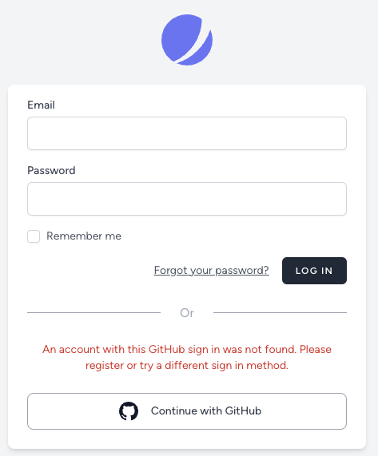

# Handling OAuth Errors

When a user encounters an error returning from an OAuth flow, it will automatically detect the error and display this to the user:

<figure><figcaption></figcaption></figure>

This is done by grabbing the `error_description` from the request object and passing that value to a `socialstream` message bag. This can be accessed from your application:

```php
@error('socialstream')

$errors->get('socialstream');

session('errors')?->get('socialstream');
```

If you wish to customize how Socialstream handles callback errors, you may do so by creating an "action" that implements the `HandlesOauthCallbackErrors` contract and registering it with Socialstream in the `boot` method of a service provider:

```php
public function boot(): void
{
    Socialstream::handlesOAuthCallbackErrorsUsing(CustomOauthCallbackHandler::class);
}
```

